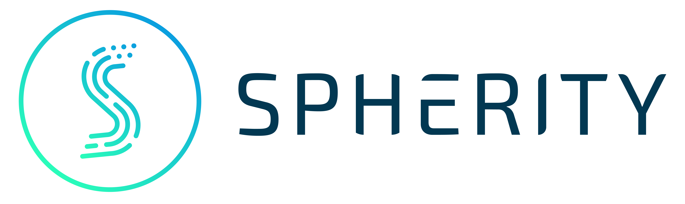

<main class="paper-page" markdown="1">
<header class="paper-header">
  
  
Spherity Research Paper

  <h1 class="paper-title">Securing Digital Identity and Verifiable Credential Wallets against Quantum Vulnerabilities</h1>
  
<strong>Public-key trust fabric risk, attack taxonomy, macro-economic exposure, and post-quantum identity corridors</strong>

  

    
Dr. Carsten Stöcker

    
Spherity GmbH

    
 2026-05-14 

  

</header>

  <strong>Central thesis.</strong> The quantum risk highlighted for elliptic-curve cryptocurrencies is a special case of a broader public-key exposure problem. Digital identity wallets, verifiable credentials, verifiable presentations, trust lists, status registries, VDRs, DNSSEC, WebPKI, and semantic registries form a public-key trust fabric that supports legal persons, supply chains, Industry 4.0, critical infrastructure, and Trusted AI. This fabric needs post-quantum migration corridors before it becomes too large to migrate safely.

<section class="abstract-box" markdown="1">
<h2 id="abstract">Abstract</h2>

Recent quantum resource estimates for elliptic-curve discrete logarithms have changed the risk posture for systems that expose long-lived public keys. The public debate has focused on Bitcoin and other cryptocurrencies, where a cryptographically relevant quantum computer (CRQC) could derive private keys from exposed elliptic-curve public keys and enable at-rest or on-spend attacks. This review paper argues that the same class of risk is broader and, in macro-economic terms, more material for digital identity. Verifiable credentials (VCs), verifiable presentations (VPs), identity wallets, issuer keys, holder-binding keys, verifier authentication keys, trust-list keys, status-list keys, decentralized identifiers, DNSSEC, WebPKI, and semantic registries all depend on public-key assumptions. A break of those assumptions could create forged identity evidence, false legal-person credentials, compromised supply-chain authority, unauthorized access to critical infrastructure, and misattributed actions by AI agents. The paper maps the cryptocurrency attack taxonomy into a digital identity taxonomy: at-rest identity attacks, on-presentation attacks, on-issuance attacks, on-registry attacks, trust-list attacks, status attacks, semantic supply-chain attacks, and on-setup attacks against privacy-preserving proof systems. It further argues that legal-person identity is a macro-economic control point. It supports onboarding, contracting, procurement, customs, AML/KYC, regulated supply chains, digital product passports, industrial automation, and Trusted AI. The exposure is therefore not limited to one asset class; it touches the transaction layer of the real economy. The main recommendation is to start work on post-quantum identity corridors: bounded, testable, end-to-end identity exchange paths in which issuance, presentation, wallet key storage, verifier authentication, trust lists, status lists, VDR resolution, semantic registries, transport security, and long-term validation are made hybrid or post-quantum-ready together.

<strong>Key findings</strong>
1. Quantum risk for digital identity is primarily a 'public-key trust fabric risk', not only a data-confidentiality risk.
2. Hybrid TLS and other channel-level upgrades are necessary, but do not protect stored credentials, presentations, trust lists, status lists, DID documents, schemas, or audit evidence.
3. Legal-person identity is a macro-economic control layer for trade, supply chains, DPPs, regulated data spaces, critical infrastructure, and Trusted AI.
4. Identity migration should start with bounded post-quantum identity corridors, not with a single big-bang migration.
5. Privacy-preserving credentials, selective disclosure, unlinkability, and revocation privacy remain major open research areas for PQC migration.

<strong>Keywords:</strong> post-quantum cryptography; cryptographically relevant quantum computer (CRQC); verifiable credentials; identity wallets; legal person identity; trust lists; VDRs; DNSSEC; digital product passports (DPP); Trusted AI; supply chain trust; regulated data space; European Business Wallet (EBW); Bitcoin; macro-economic risk analysis

</section>

<nav class="toc-box" aria-labelledby="contents-heading">
  <h2 id="contents-heading">Contents</h2>

  <ul class="toc-list">
    <li><a href="#abstract">Abstract</a></li>
    <li><a href="#1-introduction">1. Introduction</a></li>
    <li><a href="#2-quantum-risk-as-a-public-key-exposure-problem">2. Quantum risk as a public-key exposure problem</a></li>
    <li><a href="#3-digital-identity-system-model">3. Digital identity system model</a></li>
    <li><a href="#4-attack-taxonomy-for-vcs-vps-wallets-and-trust-infrastructure">4. Attack taxonomy for VCs, VPs, wallets, and trust infrastructure</a></li>
    <li><a href="#5-identity-specific-quantum-attack-scenarios">5. Identity-specific quantum attack scenarios</a></li>
    <li><a href="#6-macro-economic-exposure-why-legal-person-identity-is-larger-than-bitcoin">6. Macro-economic exposure: why legal-person identity is larger than Bitcoin</a></li>
    <li><a href="#7-standards-and-readiness-gaps">7. Standards and readiness gaps</a></li>
    <li><a href="#8-post-quantum-identity-corridors">8. Post-quantum identity corridors</a></li>
    <li><a href="#9-recommendations-for-google-and-the-wider-ecosystem">9. Recommendations for Google and the wider ecosystem</a></li>
    <li><a href="#10-limitations-and-research-agenda">10. Limitations and research agenda</a></li>
    <li><a href="#11-outlook">11. Outlook</a></li>
    <li><a href="#appendix-a-cryptographic-asset-inventory-template">Appendix A. Cryptographic asset inventory template</a></li>
    <li><a href="#appendix-b-minimal-pqc-corridor-checklist">Appendix B. Minimal PQC corridor checklist</a></li>
    <li><a href="#references">References</a></li>
  </ul>
</nav>

<h2 id="1-introduction">1. Introduction</h2>

The paper [Securing Elliptic Curve Cryptocurrencies against Quantum Vulnerabilities: Resource Estimates and Mitigations](https://arxiv.org/pdf/2603.28846) by Babbush et al. estimates that breaking 256-bit ECDLP over secp256k1 can be done with fewer than 1,200 logical qubits and fewer than 90 million Toffoli gates, or with fewer than 1,450 logical qubits and fewer than 70 million Toffoli gates. Under their superconducting architecture assumptions, the runtime can fall to minutes with fewer than half a million physical qubits [1]. The paper also distinguishes fast-clock and slow-clock quantum architectures and uses this distinction to analyze on-spend, at-rest, and on-setup attacks [1].

This is an important result for cryptocurrencies. It is also a signal for digital identity. The common substrate is not Bitcoin. The common substrate is public-key trust. If a public key can be transformed into a private key within an operational time window, then any system that exposes public keys and relies on their secrecy after exposure must be re-analyzed. Identity systems expose such keys in many places: issuer verification methods, wallet holder-binding keys, verifier request keys, trust-list anchors, status-list signing keys, DID documents, X.509 chains, DNSSEC zone keys, WebPKI certificates, and protocol metadata.

The current public debate is too narrow when it frames the problem as whether quantum computers will break Bitcoin. A better research question is: which digital trust fabrics become unsafe when public keys are no longer safe long-term identifiers? Digital identity is one of the largest such fabrics. It is being embedded into public services, enterprise onboarding, mobile wallets, regulated supply chains, digital product passports, healthcare, payments, workforce IAM, critical infrastructure, and AI governance.

The paper therefore reviews quantum risk for digital identity wallets and VC/VP ecosystems. It uses the SSI triangle as the starting model, but extends it to a trust control plane and a semantic supply chain. This is necessary because a verifier does not only check a digital signature. It checks whether the issuer is trusted, whether the credential is current, whether the wallet is acceptable, whether the verifier is authorized, whether the VDR data is correct, and whether the meaning of the claims is stable.

The main recommendation is to start work on PQC identity corridors. A corridor is a bounded identity flow, such as legal-person onboarding or digital product passport signing, in which all public-key dependencies are inventoried and moved to hybrid or post-quantum operation together. This is more realistic than a big-bang migration, and more useful than upgrading transport security alone.

<h2 id="2-quantum-risk-as-a-public-key-exposure-problem">2. Quantum risk as a public-key exposure problem</h2>

The Babbush et al. analysis is framed around cryptocurrency signatures. Its deeper lesson is that systems can no longer treat exposed ECC public keys as harmless long-term data. In classical security models, a public key can be public for decades. In a post-quantum threat model, the same public key may become a route to the private key. The practical risk depends on three factors: the algorithm, the public-key exposure surface, and the time window in which the attacker can use the recovered private key.

<strong>Public-key exposure</strong> means that a public key, verification method, certificate, DID document, trust-list entry, resolver record, registry entry, signed schema, or cryptographic parameter becomes available to an attacker long enough to support quantum-assisted private-key recovery, forgery, impersonation, or registry manipulation.

This creates <strong>Public-Key Trust Fabric Risk</strong>: the systemic risk that identity, authorization, registry, semantic, and audit systems lose integrity because their public verification material becomes usable for quantum-assisted private-key recovery or forgery.

NIST finalized ML-KEM, ML-DSA, and SLH-DSA in 2024 as the first three post-quantum standards. NIST also states that organizations should begin migration and that many quantum-vulnerable algorithms are expected to be deprecated or disallowed by 2035, with high-risk use cases moving earlier [3,4,5]. Google has publicly set a 2029 timeline for PQC migration and has called out authentication services and digital signatures as priority areas [2].

Transport-layer PQC is necessary but not sufficient. Hybrid ML-KEM in TLS helps protect network sessions against harvest-now-decrypt-later attacks. It does not protect a VC signature, a VP holder-binding proof, a trust list, a status list, a DID document, or a signed schema once the object is copied, archived, logged, audited, or presented offline. Identity systems need object-level PQC and registry-level PQC, not only channel-level PQC.

<figure class="table-figure">
  <figcaption><strong>Table 1.</strong> Translation of cryptocurrency attack terms into digital identity terms.</figcaption>
  

    <table class="academic-table translation-table">
      <thead>
        <tr>
          <th scope="col">Cryptocurrency term</th>
          <th scope="col">Identity term</th>
          <th scope="col">Interpretation</th>
        </tr>
      </thead>
      <tbody>
        <tr>
          <td>On-spend attack</td>
          <td>On-presentation attack</td>
          <td>A holder public key or proof key becomes visible during a presentation. A fast attacker derives the private key and creates a competing or later VP.</td>
        </tr>
        <tr>
          <td>At-rest attack</td>
          <td>At-rest identity attack</td>
          <td>Long-lived issuer, holder, verifier, DID, trust-list, DNSSEC, or certificate keys are exposed in registries and metadata.</td>
        </tr>
        <tr>
          <td>On-setup attack</td>
          <td>On-setup proof-system attack</td>
          <td>A trusted setup, pairing-based system, RSA group, or ZK parameter set is attacked once, then used to forge or break proofs.</td>
        </tr>
        <tr>
          <td>Public mempool exposure</td>
          <td>Presentation-channel exposure</td>
          <td>A verifier, browser, wallet, API gateway, log system, or network channel exposes proof material during an identity transaction.</td>
        </tr>
        <tr>
          <td>On-chain public-key exposure</td>
          <td>VDR and trust-registry exposure</td>
          <td>DID documents, trust lists, DNSSEC, WebPKI, ledgers, and issuer metadata expose verification material at scale.</td>
        </tr>
      </tbody>
    </table>
  

</figure>

<h2 id="3-digital-identity-system-model">3. Digital identity system model</h2>

The W3C Verifiable Credentials Data Model defines a model in which issuers create credentials, holders store and present them, and verifiers check them. Verifiable presentations can include credentials and proofs, and verifiable data registries can mediate identifiers, verification material, schemas, and revocation registries [6]. OpenID4VCI defines issuance flows and holder binding. OpenID4VP defines presentation flows using a VP token and can run through HTTPS redirects or the W3C Digital Credentials API [9,10,11].

The SSI triangle is useful, but not enough for a post-quantum threat model. The triangle must be embedded in a trust control plane. The control plane includes trust lists, trust registries, trust anchors, wallet provider certification, issuer accreditation, verifier registration, access certificates, status lists, VDR resolution, DID methods, DNSSEC, WebPKI, schema registries, context registries, policy engines, and transparency logs. In EUDI Wallet architectures, for example, trusted lists contain trust anchors, and those trust anchors are used by wallets, issuers, and relying parties to verify providers, access certificates, and other ecosystem actors [13].

A second layer is the semantic supply chain. A credential does not carry value only because it is signed. It carries value because the verifier interprets its type, schema, context, issuer authority, status, and policy meaning. In product passports and supply-chain credentials, this semantic layer links product identifiers, due diligence statements, material data, lifecycle events, customs data, and business roles. Quantum migration must therefore protect not only signatures, but also the signed and versioned meaning of the data.

<figure class="paper-figure">
  

    

      <strong>Trust control plane:</strong> trust lists · status lists · VDRs · DNSSEC/WebPKI · schemas · policy · audit logs
    

    

      

        <strong>Issuer</strong>
        Signs VC; manages status; publishes verification material.
      

      

        <strong>Holder / Wallet</strong>
        Stores VC; protects holder key; creates VP.
      

      

        <strong>Verifier</strong>
        Checks VP, issuer trust, status, semantics, and policy.
      

    

    

      <strong>Semantic supply chain:</strong> credential type · schema · context · vocabulary · issuer entitlement · policy · domain meaning
    

  

  <figcaption><strong>Figure 1.</strong> SSI triangle extended with trust control plane and semantic supply chain.</figcaption>
</figure>

<h2 id="4-attack-taxonomy-for-vcs-vps-wallets-and-trust-infrastructure">4. Attack taxonomy for VCs, VPs, wallets, and trust infrastructure</h2>

A quantum attacker does not need to attack every part of an identity ecosystem. It is enough to compromise the weakest public-key dependency on the verification path. In identity systems, this path can be longer than in a blockchain transaction. A verifier may depend on the credential proof, the holder-binding proof, the issuer DID or certificate, a trust list, a status list, a DNS name, a schema, a policy registry, and a timestamping or audit service.

<figure class="table-figure">
  <figcaption><strong>Table 2.</strong> Identity attack taxonomy and PQC-relevant controls.</figcaption>
  

    <table class="academic-table taxonomy-table">
      <thead>
        <tr>
          <th scope="col">Attack vector</th>
          <th scope="col">Primary exposure</th>
          <th scope="col">Likely attack result</th>
          <th scope="col">PQC-relevant controls</th>
        </tr>
      </thead>
      <tbody>
        <tr>
          <td>Issuer key at-rest attack</td>
          <td>Issuer public key in DID document, X.509 certificate, trust list, metadata, or VDR.</td>
          <td>Forge VCs for persons, companies, products, roles, or AI agents.</td>
          <td>Hybrid/PQC issuer signatures; short-lived keys; transparency; emergency reissuance.</td>
        </tr>
        <tr>
          <td>Holder-binding key attack</td>
          <td>Holder public key in SD-JWT VC cnf, mdoc, DID, wallet attestation, verifier logs, or presentations.</td>
          <td>Create valid VPs and impersonate the holder.</td>
          <td>Per-credential keys; nonce and audience binding; PQC holder proof; hardware-backed keys.</td>
        </tr>
        <tr>
          <td>On-presentation attack</td>
          <td>Proof material becomes visible during a VP flow, especially to a malicious or compromised verifier.</td>
          <td>Race the session or reuse recovered key to present elsewhere.</td>
          <td>Short sessions; strict verifier authentication; PQC/hybrid proofs; logging controls.</td>
        </tr>
        <tr>
          <td>On-issuance attack</td>
          <td>Wallet proof-of-possession key, issuance nonce, authorization code, or device attestation path.</td>
          <td>Bind the credential to an attacker-controlled key or clone the issued credential.</td>
          <td>PQC proof of possession; token binding; secure wallet attestation; short-lived grants.</td>
        </tr>
        <tr>
          <td>Verifier impersonation</td>
          <td>Verifier access certificate, request signing key, DNS/WebPKI key, or relying-party registration.</td>
          <td>Request sensitive credentials or trigger selective disclosure to a rogue verifier.</td>
          <td>PQC verifier authentication; trust-list controls; user-agent mediation.</td>
        </tr>
        <tr>
          <td>Trust-list attack</td>
          <td>Trust-list signing key or access CA key.</td>
          <td>Add a rogue issuer, wallet provider, verifier, or certification authority.</td>
          <td>PQC trust-list signatures; threshold control; monitoring; emergency revocation.</td>
        </tr>
        <tr>
          <td>Status-list attack</td>
          <td>Status-list signing key, hosting key, or resolver path.</td>
          <td>Make revoked credentials appear valid, or valid credentials appear revoked.</td>
          <td>PQC status signatures; replicated status services; transparency; privacy-preserving checks.</td>
        </tr>
        <tr>
          <td>VDR and DNSSEC attack</td>
          <td>DID method keys, ledger keys, DNSSEC zone keys, WebPKI certificates, or database signing keys.</td>
          <td>Replace verification material, service endpoints, or metadata.</td>
          <td>PQC-ready DID methods; PQC DNSSEC strategy; signed registry snapshots.</td>
        </tr>
        <tr>
          <td>Semantic supply-chain attack</td>
          <td>Schema, JSON-LD context, namespace, product identifier, vocabulary, or policy authority.</td>
          <td>Change the meaning of claims without changing the surface form of the credential.</td>
          <td>Signed and pinned schemas; versioned semantics; PQC registry signatures; policy audit.</td>
        </tr>
        <tr>
          <td>On-setup proof attack</td>
          <td>Trusted setups, pairings, RSA groups, accumulators, or ZK public parameters.</td>
          <td>Forge privacy proofs or break unlinkability and selective disclosure.</td>
          <td>PQC anonymous credentials research; migration plans; setup-free or transparent proof systems.</td>
        </tr>
      </tbody>
    </table>
  

</figure>

<figure class="table-figure">
  <figcaption><strong>Table 3.</strong> Risk priority by asset class.</figcaption>
  

    <table class="academic-table taxonomy-table">
      <thead>
        <tr>
          <th scope="col">Priority</th>
          <th scope="col">Asset class</th>
          <th scope="col">Reason</th>
        </tr>
      </thead>
      <tbody>
        <tr>
          <td>Very high</td>
          <td>Trust lists, access CAs, issuer root keys</td>
          <td>Ecosystem-wide impact. One compromise can affect many wallets, issuers, and verifiers.</td>
        </tr>
        <tr>
          <td>Very high</td>
          <td>Legal-person identity credentials</td>
          <td>Broad dependency across onboarding, contracting, procurement, KYC/KYB, data spaces, DPPs, and AI delegation.</td>
        </tr>
        <tr>
          <td>High</td>
          <td>Status and revocation services</td>
          <td>Controls whether a credential is accepted, suspended, or revoked.</td>
        </tr>
        <tr>
          <td>High</td>
          <td>DPP issuer and product-event credentials</td>
          <td>Supply-chain compliance, product provenance, and market surveillance impact.</td>
        </tr>
        <tr>
          <td>High</td>
          <td>AI-agent delegation credentials</td>
          <td>False authority can be executed at machine speed.</td>
        </tr>
        <tr>
          <td>Medium</td>
          <td>Short-lived low-value VPs</td>
          <td>Lower lifetime and smaller scope, provided nonce, audience, and session controls are strong.</td>
        </tr>
        <tr>
          <td>Research priority</td>
          <td>Anonymous credentials, selective disclosure, ZK systems, accumulators</td>
          <td>PQC replacements remain immature and require new privacy, size, and mobile-performance analysis.</td>
        </tr>
      </tbody>
    </table>
  

</figure>

<h2 id="5-identity-specific-quantum-attack-scenarios">5. Identity-specific quantum attack scenarios</h2>

<h3 id="5-1-issuer-key-compromise">5.1 Issuer key compromise</h3>

Issuer key compromise is the most direct high-impact case. If a public issuer key is exposed in a DID document, certificate, trust list, or metadata service, a CRQC may derive the matching private key. The attacker could then issue forged credentials. For a government PID issuer, the damage is identity fraud. For a legal-person issuer, the damage can include false corporate authority, fraudulent onboarding, and supply-chain access. For a DPP issuer, the damage can include false product data and fake compliance records.

DID Core recognizes that DID documents express verification methods such as public keys, and that these methods are used for authentication, assertion, and other verification relationships [8]. This makes DID documents useful, but also makes them long-lived public-key exposure points. Post-quantum identity design must therefore treat issuer keys as high-value public assets, not only as key material in a wallet.

<h3 id="5-2-on-presentation-attacks">5.2 On-presentation attacks</h3>

An on-presentation attack is the identity analogue of an on-spend attack. A holder presents a credential to a verifier. The VP includes a proof, a nonce, an audience, a holder-binding key, or a reference to verification material. A fast attacker who sees the relevant public key might derive the private key during the presentation window or shortly after a first presentation. The attacker could then create a valid-looking VP for the same session or for another verifier.

The analogy to Bitcoin is not exact. Most VP flows are not broadcast to a public mempool. They are usually mediated by HTTPS, mobile wallets, browsers, or enterprise APIs. This reduces broad public exposure. It does not remove the risk. Malicious verifiers, compromised relying parties, browser logs, gateway logs, mobile telemetry, support dumps, and archived presentations can expose public keys and proof material. High-value relying parties may also be targeted directly. The right mitigation is not to assume that presentation material is private; it is to use nonce-bound, audience-bound, short-lived, and eventually PQC or hybrid holder proofs.

<h3 id="5-3-on-issuance-attacks">5.3 On-issuance attacks</h3>

OpenID4VCI supports credential issuance flows in which the issuer binds a credential to holder key material. The holder later proves control of the same key during presentation [9]. This mechanism is central to wallet security. It is also a quantum exposure point. If a wallet proof-of-possession key or attestation key is quantum-vulnerable and visible during issuance, an attacker may be able to bind the credential to a key that the attacker can use or derive.

The most sensitive on-issuance targets are high-assurance credentials: national PID, legal-person identity, professional roles, regulated supply-chain roles, pharma trading partner credentials, financial KYC credentials, customs credentials, product-passport issuer rights, and AI-agent delegation credentials. In these cases, a false issuance event can have a longer lifetime than a fraudulent login. It can become a signed input to downstream trust decisions.

<h3 id="5-4-trust-list-and-access-certificate-attacks">5.4 Trust-list and access-certificate attacks</h3>

Trust lists are systemic trust objects. The EUDI Wallet Architecture and Reference Framework defines trusted lists that contain trust anchors. It also describes access certificate authorities, wallet provider trust anchors, and trust lists used by wallets and relying parties [13]. A quantum break of a trust-list signing key or access CA key could enable a rogue issuer, verifier, wallet provider, or service endpoint to appear legitimate. This attack can scale across an ecosystem because many verifiers may rely on the same list.

Trust-list migration should therefore be prioritized earlier than ordinary low-value credential migration. The trust-list layer should be hybrid or PQC-signed, monitored, timestamped, and designed for emergency key rollover. Threshold signing and key ceremonies are also relevant, but they do not remove the need for quantum-safe primitives.

<h3 id="5-5-vdr-dnssec-webpki-and-registry-attacks">5.5 VDR, DNSSEC, WebPKI, and registry attacks</h3>

VC ecosystems often rely on VDRs to resolve identifiers and verification material [6]. A VDR can be a blockchain, a database, a trusted registry, a decentralized file system, or another authoritative data source. DNSSEC can also act as identity infrastructure when domains are used to discover issuer metadata, verifier metadata, service endpoints, or DID records. DNSSEC authenticates DNS data through digital signatures over DNS resource record sets [27]. If DNSSEC or WebPKI remains quantum-vulnerable while credentials are upgraded, the verification path remains vulnerable.

There is active IETF discussion on PQC DNSSEC strategy, including the operational effect of larger PQC signatures and the need for conservative as well as lower-impact algorithm options [28]. Identity architectures that use DNS as a VDR or discovery layer should track this work closely. A credential is not quantum-safe if the resolver path that supplies its issuer keys is not safe.

<h3 id="5-6-status-revocation-and-long-term-validity">5.6 Status, revocation, and long-term validity</h3>

Status is a core identity control. The W3C Bitstring Status List specification provides a compact mechanism for expressing credential status, including suspension and revocation [14]. Yet a status list is still a signed object. If the status signing key is compromised, an attacker can make revoked credentials appear valid or can deny service by marking valid credentials as revoked.

Long-term validity is harder. A credential might be valid at the time of presentation but later unverifiable because the algorithm is broken. Identity ecosystems need rules for timestamping, archival validation, transparency logs, reissuance, and evidence preservation. This is especially important for legal-person credentials, compliance certificates, product passports, audit logs, and AI-agent actions that may be reviewed years later.

<h3 id="5-8-semantic-supply-chain-attacks">5.8 Semantic supply-chain attacks</h3>

The semantic layer is a security dependency. A signed credential may remain cryptographically valid while the meaning of a claim changes because a schema, JSON-LD context, namespace, product identifier, vocabulary, or policy authority is replaced, downgraded, or reinterpreted.

A DPP credential may contain a signed claim about recycled content, carbon footprint, due-diligence status, repair instructions, or material composition. If the vocabulary, schema version, or policy authority behind that claim is replaced or downgraded, the surface form of the credential may remain unchanged while the business meaning changes. In this case the verifier sees a valid signature, but the claim no longer has the same governed meaning.

Mitigations include signed and pinned JSON-LD contexts, immutable schema versions, governed vocabulary IRIs, transparent change logs, registry signatures, policy versioning, and explicit rules for deprecation. In a post-quantum setting, these registries and semantic authority records also need hybrid or PQC protection.

<h3 id="5-8-on-setup-attacks-against-privacy-preserving-credentials">5.8 On-setup attacks against privacy-preserving credentials</h3>

Privacy-preserving identity systems often use selective disclosure, anonymous credentials, accumulators, pairings, or zero-knowledge proofs. BBS-based VC cryptosuites, for example, are designed to support selective disclosure and unlinkability [15]. Other systems may use RSA-based CL signatures, pairing-based signatures, or SNARKs. These techniques are important for privacy, but many of their current constructions depend on quantum-vulnerable hardness assumptions or setup assumptions.

A PQC migration that only replaces ECDSA issuer signatures is incomplete. The identity community also needs PQC-ready privacy-preserving credentials. This is an open research area. It requires attention to proof size, mobile verification, offline use, unlinkability, issuer privacy, revocation privacy, QR-code limits, and formal security models.

<h3 id="5-9-agentic-ai-and-trusted-ai">5.9 Agentic AI and Trusted AI</h3>

Trusted AI requires traceability, accountability, and controlled authority. OECD AI principles call for traceability across datasets, processes, and decisions, and the EU AI Act imposes requirements such as logging, documentation, robustness, cybersecurity, and human oversight for high-risk AI systems [24,26]. NIST has also framed Trustworthy AI for critical infrastructure as a risk-management problem [25].

AI agents will increasingly sign API calls, procurement events, data-access requests, software actions, payments, and operational commands. Their authority will often be delegated through credentials from legal persons. A quantum break of legal-person identity or agent delegation credentials could create false authority at machine speed. PQC identity corridors for AI should therefore combine short-lived delegation, policy-limited VCs, revocation, device or workload attestation, and PQC/hybrid signatures.

<h2 id="6-macro-economic-exposure-why-legal-person-identity-is-larger-than-bitcoin">6. Macro-economic exposure: why legal-person identity is larger than Bitcoin</h2>

The claim that digital identity is more important than Bitcoin should be made with care. It is not a claim that any single identity credential has more market value than Bitcoin. It is a claim about dependency scope, substitution cost, and contagion channels. Bitcoin is a large but sector-specific asset system. Legal-person identity is a horizontal control layer for the real economy. It is used to establish who a company is, what it is allowed to do, which person or machine may act for it, and which data or product event can be trusted.

The scale difference is visible in macro-economic data. Bitcoin market capitalization was around USD 1.6 trillion on 9 May 2026, with daily volatility [21]. By contrast, world trade in goods and services reached about USD 34.65 trillion in 2025 according to the WTO [17]. UNCTAD reported global trade at a record USD 33 trillion in 2024 [18]. The World Bank reports global GDP in current US dollars above USD 110 trillion for 2024, and has noted that global value chains account for almost half of global trade [19,20].

Legal-person identity sits under many of these flows. It supports enterprise onboarding, beneficial ownership checks, KYC/AML, sanctions screening, procurement, customs, supply-chain due diligence, supplier qualification, electronic seals, product-passport data, industrial IoT authorization, critical infrastructure access, and accountable AI delegation. A broad loss of trust in this layer would not only cause theft. It could raise transaction costs, delay trade, increase manual verification, break automated compliance, create false provenance, disrupt just-in-time operations, and weaken AI accountability.

<figure class="table-figure">
  <figcaption><strong>Table 4.</strong> Macro-economic dependency surfaces for post-quantum identity risk.</figcaption>
  

    <table class="academic-table macro-table">
      <thead>
        <tr>
          <th scope="col">Surface</th>
          <th scope="col">Identity dependency</th>
          <th scope="col">Scale indicator</th>
          <th scope="col">Why this matters</th>
        </tr>
      </thead>
      <tbody>
        <tr>
          <td>Bitcoin asset ownership</td>
          <td>Public keys, transaction signatures, address types, wallet custody.</td>
          <td>About USD 1.6 trillion market capitalization on 9 May 2026; volatile daily [21].</td>
          <td>High financial value, but bounded to one digital asset system.</td>
        </tr>
        <tr>
          <td>World trade</td>
          <td>Legal-person identity, contracts, customs, logistics, product data, payment authorization.</td>
          <td>Goods and services trade about USD 34.65 trillion in 2025 [17].</td>
          <td>Large real-economy dependency on trusted entity and role data.</td>
        </tr>
        <tr>
          <td>Global value chains</td>
          <td>Supplier identity, due diligence, product provenance, certificates, DPPs.</td>
          <td>Almost half of global trade is linked to GVCs [19].</td>
          <td>Identity failure can propagate across suppliers and jurisdictions.</td>
        </tr>
        <tr>
          <td>Global GDP</td>
          <td>Public services, commerce, industry, finance, healthcare, energy, transport.</td>
          <td>World GDP above USD 110 trillion in current US dollars for 2024 [20].</td>
          <td>Identity is a horizontal trust layer for economic coordination.</td>
        </tr>
        <tr>
          <td>Trusted AI and critical infrastructure</td>
          <td>Legal-person delegation, workload identity, audit trails, safety cases.</td>
          <td>No single market number; exposure is systemic in high-risk sectors [25,26].</td>
          <td>False machine authority can create operational and legal risk at speed.</td>
        </tr>
      </tbody>
    </table>
  

</figure>

Digital product passports make the same point in a concrete way. The EU Ecodesign for Sustainable Products Regulation creates the basis for digital product passports, with work on identifiers, data carriers, access rights, registries, and portals [22]. Product passports are intended to support transparency across value chains, including product origin, materials, lifecycle information, and compliance evidence [22,23]. Such data is not useful if the issuer, product identifier, legal entity, supply-chain event, or status record cannot be trusted.

The macro-economic argument therefore has a simple form: cryptocurrency signatures protect asset ownership in a specific network; legal-person identity protects authority and accountability across many networks. The latter is a larger dependency surface. It should receive at least the same public attention in post-quantum migration planning.

<h2 id="7-standards-and-readiness-gaps">7. Standards and readiness gaps</h2>

There is no single identity standard that can solve the PQC migration. The identity stack is multi-layered. W3C VC Data Integrity secures credentials and constrained digital documents through signatures and related proofs [7]. W3C VC JOSE/COSE secures credentials and presentations with JOSE, SD-JWT, and COSE [12]. DID Core defines identifiers and verification methods [8]. OpenID4VCI and OpenID4VP define issuance and presentation flows [9,10]. The Digital Credentials API adds browser and user-agent mediation [11]. EUDI Wallet architectures add trusted lists, access certificates, and regulated ecosystem roles [13]. Each layer must be assessed.

Google has made relevant platform moves. Chrome moved toward standardized ML-KEM for hybrid key exchange in BoringSSL and Chrome [30]. Android 17 adds ML-DSA support in Android Keystore and related PQC work for hardware-backed identity and authentication paths [29]. Google Cloud KMS has introduced quantum-safe signatures, including ML-DSA and SLH-DSA capabilities [31]. These are important foundations. They do not by themselves define end-to-end PQC identity profiles for VCs, VPs, trust lists, status lists, DID methods, or semantic registries.

<figure class="table-figure">
  <figcaption><strong>Table 5.</strong> Standards readiness categories for PQC digital identity.</figcaption>
  

    <table class="academic-table taxonomy-table">
      <thead>
        <tr>
          <th scope="col">Category</th>
          <th scope="col">Examples</th>
          <th scope="col">Role in migration</th>
        </tr>
      </thead>
      <tbody>
        <tr>
          <td>Existing identity standards</td>
          <td>W3C VCDM, W3C Data Integrity, W3C VC JOSE/COSE, DID Core, OpenID4VCI, OpenID4VP, Digital Credentials API</td>
          <td>Define the current identity object, issuance, presentation, and resolution layers.</td>
        </tr>
        <tr>
          <td>Existing PQC standards</td>
          <td>ML-KEM, ML-DSA, SLH-DSA</td>
          <td>Provide standardized cryptographic building blocks.</td>
        </tr>
        <tr>
          <td>Platform movement</td>
          <td>Chrome/BoringSSL hybrid key exchange, Android Keystore / KeyMint PQC work, Google Cloud KMS quantum-safe signatures</td>
          <td>Provides implementation substrate, especially for transport, mobile wallets, and cloud signing.</td>
        </tr>
        <tr>
          <td>Missing identity profiles</td>
          <td>PQC VC signatures, PQC holder binding, PQC verifier request signing, PQC trust lists, PQC status lists, PQC DID methods, PQC semantic registries</td>
          <td>Needs standard profiles, test vectors, algorithm identifiers, governance rules, and interoperability testing.</td>
        </tr>
        <tr>
          <td>Open research</td>
          <td>PQC anonymous credentials, selective disclosure, unlinkability, revocation privacy, mobile proof sizes, QR-code constraints</td>
          <td>Needs research before production-grade privacy-preserving wallet migration.</td>
        </tr>
      </tbody>
    </table>
  

</figure>

<figure class="table-figure">
  <figcaption><strong>Table 6.</strong> Standards readiness gap for PQC digital identity.</figcaption>
  

    <table class="academic-table standards-table">
      <thead>
        <tr>
          <th scope="col">Layer</th>
          <th scope="col">Current standards or platforms</th>
          <th scope="col">PQC gap</th>
        </tr>
      </thead>
      <tbody>
        <tr>
          <td>Credential object</td>
          <td>W3C VC Data Model; VC Data Integrity; VC JOSE/COSE [6,7,12].</td>
          <td>PQC and hybrid signature suites, algorithm identifiers, canonicalization rules, and proof-purpose validation.</td>
        </tr>
        <tr>
          <td>Issuance</td>
          <td>OpenID4VCI [9].</td>
          <td>PQC proof of possession, wallet attestation, nonce binding, and issuer metadata signatures.</td>
        </tr>
        <tr>
          <td>Presentation</td>
          <td>OpenID4VP; Digital Credentials API [10,11].</td>
          <td>PQC holder binding, verifier request signing, browser capability signaling, and anti-replay design.</td>
        </tr>
        <tr>
          <td>Wallet key storage</td>
          <td>Android Keystore, KeyMint, secure hardware, vendor-specific wallet stacks [29].</td>
          <td>Hardware-backed ML-DSA/SLH-DSA keys, attestation, recovery, and migration rules.</td>
        </tr>
        <tr>
          <td>Trust infrastructure</td>
          <td>EUDI trust lists, access certificates, WebPKI, DNSSEC [13,27].</td>
          <td>PQC trust anchors, PQC access CAs, rollover rules, and auditability.</td>
        </tr>
        <tr>
          <td>Status and revocation</td>
          <td>Bitstring Status List and related status services [14].</td>
          <td>PQC status signatures, transparency, privacy-preserving checks, and long-term evidence.</td>
        </tr>
        <tr>
          <td>VDRs and DID methods</td>
          <td>DID Core and method-specific registries [8].</td>
          <td>PQC verification methods, method-specific key rotation, and registry migration.</td>
        </tr>
        <tr>
          <td>Semantic layer</td>
          <td>Schemas, JSON-LD contexts, vocabularies, product identifiers, policy registries.</td>
          <td>Signed and pinned semantics, versioned authority, and PQC registry protection.</td>
        </tr>
        <tr>
          <td>Privacy-preserving proofs</td>
          <td>BBS cryptosuites, CL signatures, ZK systems, accumulators [15].</td>
          <td>PQC anonymous credentials, selective disclosure, unlinkability, and quantum-safe revocation.</td>
        </tr>
      </tbody>
    </table>
  

</figure>

A narrow algorithm substitution model will fail. Identity migration must account for key lifecycle, credential lifetime, presentation frequency, user experience, offline use, QR size, mobile hardware, trust-list governance, compliance rules, and audit requirements. It must also handle legacy credentials and dormant identity records that cannot be reissued quickly.

<h2 id="8-post-quantum-identity-corridors">8. Post-quantum identity corridors</h2>

A post-quantum identity corridor is a governed, end-to-end identity exchange path in which all public-key dependencies are inventoried and moved to hybrid or post-quantum readiness together. A corridor is not only a credential format. It is a full path: issuer signature, wallet key storage, holder binding, verifier authentication, issuance channel, presentation channel, trust-list signing, status-list signing, VDR resolution, DID or certificate chain, DNSSEC/WebPKI dependency, schema/context integrity, policy validation, timestamping, audit, and reissuance.

Corridors are useful because identity ecosystems are too fragmented for a single migration event. They allow high-risk flows to move first, while preserving interoperability. They also create test beds for standards work and give platform teams clear requirements. A legal-person onboarding corridor, for example, can test issuer signatures, holder binding, trust-list verification, status checks, and verifier authorization without waiting for every consumer identity use case to migrate.

<figure class="table-figure">
  <figcaption><strong>Table 7.</strong> Maturity levels for PQC identity corridors.</figcaption>
  

    <table class="academic-table maturity-table">
      <thead>
        <tr>
          <th scope="col">Level</th>
          <th scope="col">Name</th>
          <th scope="col">Requirement</th>
        </tr>
      </thead>
      <tbody>
        <tr>
          <td>0</td>
          <td>Inventory</td>
          <td>All algorithms, public-key exposure locations, key owners, VDRs, trust lists, status lists, and credential lifetimes are known.</td>
        </tr>
        <tr>
          <td>1</td>
          <td>Hybrid transport</td>
          <td>TLS, APIs, and wallet-verifier channels use hybrid/PQC key establishment where available.</td>
        </tr>
        <tr>
          <td>2</td>
          <td>Hybrid credential proofs</td>
          <td>Issuer signatures, holder-binding proofs, verifier request signatures, and wallet attestations support classical plus PQC algorithms.</td>
        </tr>
        <tr>
          <td>3</td>
          <td>Hybrid trust infrastructure</td>
          <td>Trust lists, status lists, VDR records, DID documents, DNSSEC/WebPKI dependencies, and schema registries have PQC migration paths.</td>
        </tr>
        <tr>
          <td>4</td>
          <td>Long-term validation</td>
          <td>Timestamping, transparency, archival validation, emergency rollover, reissuance, and evidence policies are defined.</td>
        </tr>
        <tr>
          <td>5</td>
          <td>PQC-native privacy</td>
          <td>Selective disclosure, unlinkability, revocation privacy, and anonymous credentials use quantum-resistant constructions.</td>
        </tr>
      </tbody>
    </table>
  

</figure>

Candidate corridors should be chosen by risk and leverage. Initial corridors should include legal-person identity, regulated supply-chain credentials, pharma trading partner credentials, digital product passport credentials, critical infrastructure operator credentials, EUDI PID/QEAA flows, financial KYC/AML credentials, and AI-agent delegation credentials. These flows have high assurance needs, long credential lifetimes, and strong macro-economic relevance.

A practical corridor should define at least four artefact classes: a threat model, a cryptographic profile, test vectors, and operational runbooks. The runbooks should include key rollover, emergency revocation, reissuance, downgrade prevention, audit evidence, and fallback rules for offline verification.

<h3 id="8-1-minimum-viable-design-PQC-legal-person-onboarding-and-data-sharing-corridor">8.1 Minimum viable design: PQC legal-person onboarding and data sharing corridor</h3>

A concrete legal-person onboarding corridor could be implemented as follows:

1. A business register or authorized legal-person identity issuer issues a legal-person credential using a hybrid or PQC-ready issuer signature. 
2. The enterprise wallet stores the credential and uses hybrid or PQC-ready holder binding.
3. The verifier authenticates with a PQC-ready access certificate or verifier credential.
4. The relevant trust list is hybrid or PQC-signed and supports emergency rollover.
5. The relevant status list is hybrid or PQC-signed and supports suspension, revocation, and long-term evidence.
6. DID, VDR, DNSSEC, or certificate-chain dependencies have an explicit migration path.
7. The presentation is nonce-bound, audience-bound, short-lived, and protected against downgrade.
8. Audit evidence is timestamped and can be revalidated or reissued after algorithm deprecation.
9. Schema, context, and vocabulary versions are signed, pinned, and monitored.
10. Emergency procedures define key rollover, verifier fallback, mass reissuance, and public incident communication.
11. E2E data sharing protocol

This corridor is narrow enough to test, but broad enough to expose the main end-to-end dependencies that matter for enterprise identity, EBW, regulated supply chains, and Trusted AI.

<h3 id="8-2-example-a-transatlantic-legal-person-onboardin-and-data-sharing-corridor">8.2 Example: A Transatlantic Legal-Person Onboarding and Data Sharing Corridor</h3>

A concrete implementation could start with a transatlantic legal-person identity and data sharing corridor between European and U.S. company identity sources.

On the European side, the corridor could use the European Unique Identifier (EUID) and national business-register data as the authoritative basis for a legal-person credential. The EUID is used in the Business Registers Interconnection System (BRIS), through which EU Member State business registers have been interconnected and searchable since June 2017. For Germany, the Bundesanzeiger Verlag operates the Unternehmensregister, the German Company Register, and is the German member of the European Business Register network. The Unternehmensregister is the central platform for company data in Germany. The Bundesanzeiger Verlag platform also links to the Company Register, Transparency Register, Federal Law Gazette, eBilanz-Online, Legal Entity Identifier Register, and European Business Register.

For the U.S. side, the corridor should not rely on a single federal company-register identifier. The U.S. does not have one national company register comparable to BRIS or the German Unternehmensregister. Legal entities are generally formed and registered at state level, for example through Secretary of State business registries. A U.S. legal-person credential should therefore bind the company’s legal name, jurisdiction of formation, state registry identifier or file number, registered status, registered agent information where available, and source evidence from the relevant state registry. The Employer Identification Number (EIN) may be added as a corroborating tax identifier issued by the IRS, but it should not be treated as proof of legal existence or good standing. If a private or sectoral aggregation service is used, it should preserve the original state source, timestamp, evidence chain, and update status rather than replacing them with an opaque aggregated identifier.

A U.S. register-derived company identifier could be constructed in a way that is functionally similar to the EUID pattern, while remaining clearly distinct from an official national U.S. company identifier. The EUID combines the country code, register identifier, national registration number, and, where applicable, a verification digit. In the U.S., a comparable credential-internal composite identifier could combine: country = US, state or jurisdiction code, state registry authority, state entity ID or file number, and optional checksum, version, or source reference. This creates a stable, machine-readable anchor for verification while preserving the original state registry as the authoritative source.

<figure class="table-figure">
  <figcaption><strong>Table 8.</strong> Comparison of EU EUID and a U.S. state-registry-derived company identifier.</figcaption>
  

    <table class="academic-table taxonomy-table">
      <thead>
        <tr>
          <th scope="col">Aspect</th>
          <th scope="col">EU EUID</th>
          <th scope="col">U.S. state-registry-derived company identifier</th>
        </tr>
      </thead>
      <tbody>
        <tr>
          <td>Legal status</td>
          <td>Official European identifier used in BRIS for companies and branches across Member State registers.</td>
          <td>Not an official national U.S. identifier. It would be a credential-internal composite identifier derived from state registry evidence.</td>
        </tr>
        <tr>
          <td>Registry model</td>
          <td>Member State business registers are interconnected through BRIS and the European Central Platform.</td>
          <td>Company formation and registration are mainly state-level processes, usually handled by Secretary of State or equivalent state registries.</td>
        </tr>
        <tr>
          <td>Identifier structure</td>
          <td>Country code + register identifier + registration number + optional verification digit.</td>
          <td>US + state or jurisdiction code + state registry authority + state entity ID, file number, or registration number + optional checksum or source reference.</td>
        </tr>
        <tr>
          <td>Example pattern</td>
          <td>DE + register code + German commercial register number, for example a Hamburg HRB number encoded in an EUID.</td>
          <td>US-DE + Delaware Division of Corporations + Delaware file number, or US-CA + California Secretary of State + California entity number.</td>
        </tr>
        <tr>
          <td>Cross-border / cross-jurisdiction function</td>
          <td>Designed for cross-border identification within the EU business register system.</td>
          <td>Can support cross-state and cross-border verification only if the credential includes jurisdiction, registry source, timestamp, and evidence chain.</td>
        </tr>
        <tr>
          <td>Use in verifiable credentials</td>
          <td>Can be used as a strong anchor for EU legal-person credentials.</td>
          <td>Can be used as a strong anchor for U.S. legal-person credentials if it remains linked to the original state registry record.</td>
        </tr>
        <tr>
          <td>Relation to EIN</td>
          <td>Separate from tax identifiers.</td>
          <td>EIN can be added as a corroborating federal tax identifier, but it does not replace the state registry identifier.</td>
        </tr>
      </tbody>
    </table>
  

</figure>

In such a corridor, a German GmbH receives a verifiable legal-person credential containing its EUID and national register evidence from the Unternehmensregister. This credential could be represented as an EU Company Certificate (EUCC) credential or as an European Business Wallet Owner ID (EBWOID) credential. Here, EUCC refers to a verifiable company credential that contains selected register-derived claims about a legal person, such as legal name, legal form, register number, registered address, status, and representatives. EBWOID refers to a wallet-owner identifier credential for the legal person that binds the enterprise wallet to the organization it represents. The EUCC describes the legal person. The EBWOID binds the wallet instance or wallet owner to that legal person. Together, they support machine-verifiable company authentication, wallet binding, and authorization.

A U.S. corporation or LLC could receive a comparable verifiable credential containing its state of formation, Secretary of State file number or entity ID, legal name, registered status, registered agent information where legally available, and source reference to the relevant state registry. The credential could also include the constructed U.S. state-registry-derived company identifier as a machine-readable anchor. These credentials would not replace the underlying registers. They would make selected register facts machine-verifiable for authentication, onboarding, KYC/KYB, procurement, data-space participation, customs submission, supply chain data charing, and AI-agent delegation.

For PQC-ready Business Wallet use cases, the European credential can be anchored in the EUID and national business-register evidence. For U.S. use cases, the credential can be anchored in the relevant state registry identifier and strengthened through additional corroboration, for example EIN, LEI reference data, beneficial-ownership information where legally accessible, sectoral licenses, tax-status evidence, or regulated-industry registrations. A verifier would then authenticate the company by checking the credential signature, issuer trust status, register evidence, current status or revocation information, and policy rules for the specific transaction.

The same corridor would also test the post-quantum dependencies end to end. The legal-person issuer would use hybrid or PQC-ready issuer signatures. The enterprise wallet would use hybrid or PQC-ready holder binding. Verifiers would authenticate with PQC-ready verifier credentials or access certificates. Trust lists, status lists, schema registries, vocabulary registries, and audit records would be signed, versioned, monitored, and prepared for emergency rollover. This makes the corridor useful not only for legal-person onboarding, but also for cross-border B2B authentication, regulated supply-chain access, digital product passport workflows, and Trusted AI delegation.

The corridor could also support PQC-ready end-to-end communication between authenticated and authorized legal persons. If for instance encryption keys or key-agreement material are registered in a DID document, certificate-bound DID, or equivalent wallet-controlled discovery record, the parties can establish a PQC-ready secure communication channel after mutual authentication and authorization. In an early implementation, this could support encrypted API communication for a digital data-sharing corridor. In a later implementation, the same trust model could support a DIDComm-based persistent channel between enterprise wallets or wallet-connected systems. The important point is that the communication channel would not be established between anonymous endpoints. It would be established between verified legal persons whose credentials, wallet bindings, roles, authorization policies, and key material can be checked before data is exchanged.

<h2 id="9-recommendations-for-google-and-the-wider-ecosystem">9. Recommendations for Google and the wider ecosystem</h2>

Google is well positioned to help reframe the public discourse. It has quantum research, cryptography engineering, Chrome, Android, Cloud KMS, identity systems, browser mediation, and developer reach. Google has also already stated that authentication services and digital signatures should be prioritized in PQC migration [2]. The next step is to make digital identity a first-class post-quantum migration topic.

The work should not be Google-centric. The relevant ecosystem also includes the European Commission, ENISA, BSI, ETSI, CEN/CENELEC, W3C, OpenID Foundation, IETF, NIST, EUDI Wallet implementers, European Business Wallet stakeholders, international business wallet and data space projects, qualified trust service providers, business registers, wallet vendors, regulated industry issuers, cloud providers, mobile platform providers, and critical-infrastructure operators.

<figure class="table-figure">
  <figcaption><strong>Table 9.</strong> Recommendations for a PQC digital identity work program.</figcaption>
  

    <table class="academic-table recommendation-table">
      <thead>
        <tr>
          <th scope="col">No.</th>
          <th scope="col">Recommendation</th>
          <th scope="col">Rationale and first action</th>
        </tr>
      </thead>
      <tbody>
        <tr>
          <td>1</td>
          <td>Move the public question from Bitcoin to public-key trust fabrics.</td>
          <td>The public discussion should shift from “will quantum computers break Bitcoin?” to “which identity, trust, and digital signature systems become unsafe when public keys can be inverted?” This keeps cryptocurrency risk in scope, but adds identity wallets, legal-person identity, VCs, VPs, trust lists, status services, VDRs, DNSSEC, WebPKI, and semantic registries.</td>
        </tr>
        <tr>
          <td>2</td>
          <td>Start a PQC Identity Corridors initiative.</td>
          <td>Convene a focused technical group with Google Quantum AI, Google Security, Android, Chrome, Cloud KMS, W3C VC groups, OpenID Foundation, IETF, NIST, ENISA, BSI, EUDI Wallet stakeholders, EBW stakeholders, wallet vendors, regulated issuers, business registers, and critical-infrastructure operators.</td>
        </tr>
        <tr>
          <td>3</td>
          <td>Build reference implementations.</td>
          <td>Initial implementations should include ML-DSA issuer-signed VCs, hybrid SD-JWT VC holder binding, a Data Integrity hybrid proof suite, PQC trust-list signatures, PQC status-list signatures, Android Keystore-backed wallet keys, Digital Credentials API capability signaling, and VDR/DNSSEC migration tests.</td>
        </tr>
        <tr>
          <td>4</td>
          <td>Separate channel security from object security.</td>
          <td>Hybrid TLS protects the session. It does not make a credential, presentation, trust list, status list, DID document, schema, or audit artefact safe after storage, logging, offline presentation, or archival review.</td>
        </tr>
        <tr>
          <td>5</td>
          <td>Prioritize legal-person identity.</td>
          <td>Legal-person credentials sit under supply chains, Industry 4.0, critical infrastructure, DPPs, procurement, KYC/AML, and AI delegation. They should be treated as high-risk migration targets, not as a secondary enterprise use case.</td>
        </tr>
        <tr>
          <td>6</td>
          <td>Publish a joint threat model and test suite.</td>
          <td>A shared threat model should define on-presentation, on-issuance, on-registry, trust-list, status-list, semantic, and on-setup attacks. Test suites should include downgrade attempts, key rollover, expired trust anchors, status forgery, schema replacement, and mixed classical/PQC chains.</td>
        </tr>
        <tr>
          <td>7</td>
          <td>Define a semantic registry protection profile.</td>
          <td>JSON-LD contexts, schemas, vocabularies, namespaces, product identifiers, and policy registries should be signed, pinned, versioned, monitored, and prepared for PQC migration.</td>
        </tr>
        <tr>
          <td>8</td>
          <td>Create an open research track for PQC privacy.</td>
          <td>Anonymous credentials, selective disclosure, unlinkability, and privacy-preserving revocation need new PQC-ready constructions with mobile, QR-code, and offline constraints.</td>
        </tr>
      </tbody>
    </table>
  

</figure>

The most valuable near-term outcome would be a short public position paper and a technical work plan. The position paper should state that identity is a primary PQC risk surface. The work plan should define two or three concrete corridors and publish early interoperability artefacts.

<h2 id="10-limitations-and-research-agenda">10. Limitations and research agenda</h2>

This paper does not claim that a CRQC exists today. The resource estimates in [1] depend on architecture assumptions, error correction, timing, and scale-up assumptions. It also does not claim that every identity presentation is as exposed as a public blockchain transaction. Many VP flows are private, authenticated, and short-lived. The risk argument is about high-value exposure points, reuse, logging, malicious verifiers, public registries, and long-term trust objects.

Several identity standards are still evolving. PQC algorithm identifiers, hybrid signature encodings, Data Integrity suites, JOSE/COSE profiles, device attestation support, and privacy-preserving PQC credentials need further work. Standards bodies should avoid premature fragmentation, but they should not wait until CRQC timelines are certain.

1. Which PQC signature profiles are best for VCs, VPs, trust lists, and status lists when mobile size, QR codes, and offline verification matter?

2. How should hybrid signatures be represented consistently across Data Integrity, JOSE, COSE, SD-JWT VC, and mdoc profiles?

3. How can holder binding be PQC-ready without creating long-lived correlatable public keys?

4. What is the PQC replacement path for BBS+, CL signatures, pairing-based anonymous credentials, accumulators, and ZK proof systems?

5. How should long-term validation work after classical public-key algorithms are deprecated or broken?

6. How should EUDI-style trust lists, access certificates, and wallet attestations migrate without ecosystem downtime?

7. How should DNSSEC and WebPKI migration be coordinated with DID and VDR migration?

8. How should legal-person credentials delegate authority to AI agents in a way that is short-lived, revocable, auditable, and quantum-safe?

<h2 id="11-outlook">11. Outlook</h2>

The cryptocurrency analysis in [1] is a useful warning because it turns an abstract quantum concern into an operational attack model. Digital identity needs the same shift. The key question is not only when a quantum computer will break a curve. The key question is whether identity ecosystems will have already built migration paths for the public keys, trust anchors, registries, and semantics that they publish today.

The priority should be calm and concrete engineering: inventory public-key dependencies, avoid unnecessary long-lived key exposure, add crypto agility, pilot PQC corridors in high-risk legal-person and supply-chain flows, and define rules for reissuance and long-term evidence. This work should begin before identity wallets, DPPs, and AI-agent authority systems reach full scale.

<h2 id="appendix-a-cryptographic-asset-inventory-template">Appendix A. Cryptographic asset inventory template</h2>

<figure class="table-figure">
  <figcaption><strong>Table A1.</strong> Cryptographic asset inventory template.</figcaption>
  

    <table class="academic-table inventory-table">
      <thead>
        <tr>
          <th scope="col">Inventory item</th>
          <th scope="col">What to record</th>
        </tr>
      </thead>
      <tbody>
        <tr>
          <td>Asset</td>
          <td>Example values</td>
        </tr>
        <tr>
          <td>Key owner</td>
          <td>Issuer, wallet, verifier, trust-list operator, status service, VDR operator, DNS zone owner, schema owner.</td>
        </tr>
        <tr>
          <td>Algorithm and parameter set</td>
          <td>ECDSA P-256, Ed25519, RSA-2048, BLS12-381, ML-DSA-65, SLH-DSA, hybrid profile.</td>
        </tr>
        <tr>
          <td>Public-key exposure location</td>
          <td>DID document, X.509 certificate, trust list, issuer metadata, wallet metadata, DNSSEC, logs, presentations.</td>
        </tr>
        <tr>
          <td>Key lifetime</td>
          <td>Hours, days, months, years; rollover frequency; emergency rollover process.</td>
        </tr>
        <tr>
          <td>Credential lifetime</td>
          <td>Session-only, short-lived, annual, multi-year, lifetime.</td>
        </tr>
        <tr>
          <td>Status dependency</td>
          <td>Bitstring status list, token status list, OCSP-like service, registry lookup, offline status evidence.</td>
        </tr>
        <tr>
          <td>VDR dependency</td>
          <td>Blockchain, DNSSEC, WebPKI, database, decentralized file system, trusted registry.</td>
        </tr>
        <tr>
          <td>Semantic dependency</td>
          <td>Schema, JSON-LD context, vocabulary, product identifier, policy registry, authority registry.</td>
        </tr>
        <tr>
          <td>PQC readiness</td>
          <td>None, crypto-agile, hybrid transport, hybrid object signature, PQC-native, PQC privacy.</td>
        </tr>
        <tr>
          <td>Migration owner</td>
          <td>Named team and governance body.</td>
        </tr>
        <tr>
          <td>Reissuance process</td>
          <td>Trigger, user or enterprise action, batch process, emergency revocation, fallback.</td>
        </tr>
      </tbody>
    </table>
  

</figure>

<h2 id="appendix-b-minimal-pqc-corridor-checklist">Appendix B. Minimal PQC corridor checklist</h2>

The following checklist prioritizes the minimum viable controls for a PQC-ready legal-person onboarding and data-sharing corridor, using MoSCoW levels to separate essential launch requirements from later hardening steps.

<figure class="table-figure">
  <figcaption><strong>Table B.1</strong> MoSCoW-prioritized checklist for a minimum viable PQC-ready onboarding and data-sharing corridor.</figcaption>
  

    <table class="academic-table recommendation-table">
      <thead>
        <tr>
          <th scope="col">No.</th>
          <th scope="col">Checklist item</th>
          <th scope="col">MoSCoW level</th>
        </tr>
      </thead>
      <tbody>
        <tr>
          <td>1</td>
          <td>Issuer signatures are hybrid or PQC-ready, and algorithm identifiers are unambiguous.</td>
          <td>Must-have</td>
        </tr>
        <tr>
          <td>2</td>
          <td>Holder-binding proofs are hybrid or PQC-ready, nonce-bound, audience-bound, and not reusable across contexts.</td>
          <td>Must-have</td>
        </tr>
        <tr>
          <td>3</td>
          <td>Verifier request signatures and verifier access certificates are hybrid or PQC-ready.</td>
          <td>Must-have</td>
        </tr>
        <tr>
          <td>4</td>
          <td>Wallet keys are protected in secure hardware where possible, have attestation paths, and support controlled key rotation.</td>
          <td>Should-have</td>
        </tr>
        <tr>
          <td>5</td>
          <td>Trust lists, access CA chains, and qualified or sectoral trust anchors are hybrid or PQC-ready, monitored, and prepared for emergency rollover.</td>
          <td>Must-have</td>
        </tr>
        <tr>
          <td>6</td>
          <td>Status lists and revocation services are hybrid or PQC-ready, highly available, and resilient to denial of service.</td>
          <td>Must-have</td>
        </tr>
        <tr>
          <td>7</td>
          <td>DID methods, VDRs, resolver infrastructure, and identifier registries have explicit PQC migration paths.</td>
          <td>Should-have</td>
        </tr>
        <tr>
          <td>8</td>
          <td>DNSSEC, WebPKI, certificate transparency, and endpoint authentication dependencies are identified and have migration or fallback paths.</td>
          <td>Should-have</td>
        </tr>
        <tr>
          <td>9</td>
          <td>Schemas, JSON-LD contexts, namespaces, vocabularies, product identifiers, and policy registries are signed, pinned, versioned, and monitored.</td>
          <td>Should-have</td>
        </tr>
        <tr>
          <td>10</td>
          <td>Authorization policies are machine-readable, versioned, and bound to verified legal-person identity, role credentials, delegation credentials, and transaction context.</td>
          <td>Must-have</td>
        </tr>
        <tr>
          <td>11</td>
          <td>Transport channels use hybrid or PQC key establishment where available, for example TLS 1.3 with hybrid ECDHE/ML-KEM or PQC-ready key establishment profiles.</td>
          <td>Must-have</td>
        </tr>
        <tr>
          <td>12</td>
          <td>End-to-end encryption between authenticated legal persons is supported where data is exchanged beyond a single transport session, for example wallet-to-wallet, connector-to-connector, or DIDComm-based communication.</td>
          <td>Should-have</td>
        </tr>
        <tr>
          <td>13</td>
          <td>PQC-ready encryption or key-agreement material can be discovered through DID documents, certificate-bound DIDs, wallet metadata, or equivalent authenticated discovery records.</td>
          <td>Should-have</td>
        </tr>
        <tr>
          <td>14</td>
          <td>A participant discovery mechanism exists for the corridor, for example a simple directory or “yellow pages” service that lists PQC-ready issuers, wallets, verifiers, trust anchors, supported algorithms, endpoints, roles, and assurance levels.</td>
          <td>Must-have</td>
        </tr>
        <tr>
          <td>15</td>
          <td>The discovery mechanism is authenticated, signed, versioned, monitored, and protected against downgrade, spoofing, stale metadata, unauthorized endpoint substitution, and unauthorized role claims.</td>
          <td>Must-have</td>
        </tr>
        <tr>
          <td>16</td>
          <td>Downgrade prevention and mixed classical/PQC verification rules are defined and tested across issuance, presentation, verification, discovery, revocation, and communication flows.</td>
          <td>Must-have</td>
        </tr>
        <tr>
          <td>17</td>
          <td>Long-term validation, timestamping, archival evidence, and audit evidence can be revalidated after algorithm deprecation.</td>
          <td>Should-have</td>
        </tr>
        <tr>
          <td>18</td>
          <td>Logging rules minimize stored presentation material, proof artefacts, encryption metadata, key-agreement artefacts, and unnecessary personal or business-sensitive data.</td>
          <td>Should-have</td>
        </tr>
        <tr>
          <td>19</td>
          <td>Incident runbooks cover trust-list compromise, issuer-key compromise, holder-key compromise, verifier-key compromise, status-list compromise, semantic-registry compromise, discovery-service compromise, and endpoint-key compromise.</td>
          <td>Must-have</td>
        </tr>
        <tr>
          <td>20</td>
          <td>Reissuance and rollover procedures are tested for individual credentials, wallet keys, trust anchors, status lists, semantic registries, discovery records, and ecosystem-wide migration events.</td>
          <td>Must-have</td>
        </tr>
      </tbody>
    </table>
  

</figure>

<strong>MoSCoW levels:</strong>

<ul>
  <li><strong>Must-have:</strong> essential for a minimum viable PQC-ready onboarding and data-sharing corridor.</li>
  <li><strong>Should-have:</strong> important for resilience, assurance, and long-term operation, but not blocking the first controlled corridor pilot.</li>
  <li><strong>Could-have:</strong> useful hardening or usability feature that can be added after the first corridor is stable.</li>
  <li><strong>Won’t-have:</strong> not needed for the minimum viable corridor and should be kept out of the first implementation scope.</li>
</ul>

<section class="references" markdown="1">

<h2 id="references">References</h2>

**[1]** Babbush, R., Zalcman, A., Gidney, C., Broughton, M., Khattar, T., Neven, H., Bergamaschi, T., Drake, J., and Boneh, D. "Securing Elliptic Curve Cryptocurrencies against Quantum Vulnerabilities: Resource Estimates and Mitigations." arXiv:2603.28846, 2026. [https://arxiv.org/abs/2603.28846](https://arxiv.org/abs/2603.28846)

**[2]** Adkins, H. and Schmieg, S. "Quantum frontiers may be closer than they appear." Google, 2026. [https://blog.google/innovation-and-ai/technology/safety-security/cryptography-migration-timeline/](https://blog.google/innovation-and-ai/technology/safety-security/cryptography-migration-timeline/)

**[3]** National Institute of Standards and Technology. "NIST Releases First 3 Finalized Post-Quantum Encryption Standards." 2024. [https://www.nist.gov/news-events/news/2024/08/nist-releases-first-3-finalized-post-quantum-encryption-standards](https://www.nist.gov/news-events/news/2024/08/nist-releases-first-3-finalized-post-quantum-encryption-standards)

**[4]** NIST Computer Security Resource Center. "Post-Quantum Cryptography." [https://csrc.nist.gov/projects/post-quantum-cryptography](https://csrc.nist.gov/projects/post-quantum-cryptography)

**[5]** Moody, D. et al. "Transition to Post-Quantum Cryptography Standards." NIST IR 8547 Initial Public Draft, 2024. [https://csrc.nist.gov/pubs/ir/8547/ipd](https://csrc.nist.gov/pubs/ir/8547/ipd)

**[6]** World Wide Web Consortium. "Verifiable Credentials Data Model v2.0." W3C Recommendation, 2025. [https://www.w3.org/TR/vc-data-model-2.0/](https://www.w3.org/TR/vc-data-model-2.0/)

**[7]** World Wide Web Consortium. "Verifiable Credential Data Integrity 1.0." W3C Recommendation, 2025. [https://www.w3.org/TR/vc-data-integrity/](https://www.w3.org/TR/vc-data-integrity/)

**[8]** World Wide Web Consortium. "Decentralized Identifiers (DIDs) v1.0." W3C Recommendation, 2022. [https://www.w3.org/TR/did-core/](https://www.w3.org/TR/did-core/)

**[9]** OpenID Foundation. "OpenID for Verifiable Credential Issuance." [https://openid.net/specs/openid-4-verifiable-credential-issuance-1_0.html](https://openid.net/specs/openid-4-verifiable-credential-issuance-1_0.html)

**[10]** OpenID Foundation. "OpenID for Verifiable Presentations." [https://openid.net/specs/openid-4-verifiable-presentations-1_0.html](https://openid.net/specs/openid-4-verifiable-presentations-1_0.html)

**[11]** World Wide Web Consortium. "Digital Credentials API." W3C Working Draft. [https://www.w3.org/TR/digital-credentials/](https://www.w3.org/TR/digital-credentials/)

**[12]** World Wide Web Consortium. "Securing Verifiable Credentials using JOSE and COSE." [https://www.w3.org/TR/vc-jose-cose/](https://www.w3.org/TR/vc-jose-cose/)

**[13]** European Commission. "European Digital Identity Wallet Architecture and Reference Framework 1.10." [https://eudi.dev/1.10.0/architecture-and-reference-framework-main/](https://eudi.dev/1.10.0/architecture-and-reference-framework-main/)

**[14]** World Wide Web Consortium. "Bitstring Status List v1.0." [https://www.w3.org/TR/vc-bitstring-status-list/](https://www.w3.org/TR/vc-bitstring-status-list/)

**[15]** World Wide Web Consortium. "Data Integrity BBS Cryptosuites v1.0." [https://www.w3.org/TR/vc-di-bbs/](https://www.w3.org/TR/vc-di-bbs/)

**[16]** European Commission. "European Digital Identity Wallet." [https://commission.europa.eu/strategy-and-policy/priorities-2019-2024/europe-fit-digital-age/european-digital-identity_en](https://commission.europa.eu/strategy-and-policy/priorities-2019-2024/europe-fit-digital-age/european-digital-identity_en)

**[17]** World Trade Organization. "Global Trade Outlook and Statistics 2026." [https://www.wto.org/english/res_e/booksp_e/trade_outlook26_e.pdf](https://www.wto.org/english/res_e/booksp_e/trade_outlook26_e.pdf)

**[18]** UNCTAD. "Global trade hits record \$33 trillion in 2024." [https://unctad.org/news/global-trade-hits-record-33-trillion-2024](https://unctad.org/news/global-trade-hits-record-33-trillion-2024)

**[19]** World Bank. "World Development Report 2020: Trading for Development in the Age of Global Value Chains." [https://www.worldbank.org/en/publication/wdr2020](https://www.worldbank.org/en/publication/wdr2020)

**[20]** World Bank. "GDP (current US\$) - World." [https://data.worldbank.org/indicator/NY.GDP.MKTP.CD?locations=1W](https://data.worldbank.org/indicator/NY.GDP.MKTP.CD?locations=1W)

**[21]** YCharts. "Bitcoin Market Cap." Source: Blockchain.com. Data point: 1.615T USD, 9 May 2026. [https://ycharts.com/indicators/bitcoin_market_cap](https://ycharts.com/indicators/bitcoin_market_cap)

**[22]** European Commission. "Ecodesign for Sustainable Products Regulation." [https://commission.europa.eu/energy-climate-change-environment/standards-tools-and-labels/products-labelling-rules-and-requirements/ecodesign-sustainable-products-regulation_en](https://commission.europa.eu/energy-climate-change-environment/standards-tools-and-labels/products-labelling-rules-and-requirements/ecodesign-sustainable-products-regulation_en)

**[23]** Centre for European Policy Studies. "Digital Product Passport: the ticket to achieving a climate neutral and circular European economy?" [https://cdn.ceps.eu/wp-content/uploads/2024/03/Digital-Product-Passport.pdf](https://cdn.ceps.eu/wp-content/uploads/2024/03/Digital-Product-Passport.pdf)

**[24]** OECD.AI. "Accountability principle." [https://oecd.ai/en/dashboards/ai-principles/P9](https://oecd.ai/en/dashboards/ai-principles/P9)

**[25]** National Institute of Standards and Technology. "AI Risk Management Framework: Generative AI and Critical Infrastructure Profiles." [https://www.nist.gov/itl/ai-risk-management-framework](https://www.nist.gov/itl/ai-risk-management-framework)

**[26]** European Commission. "AI Act." [https://digital-strategy.ec.europa.eu/en/policies/regulatory-framework-ai](https://digital-strategy.ec.europa.eu/en/policies/regulatory-framework-ai)

**[27]** IETF. RFC 4033: "DNS Security Introduction and Requirements." [https://www.rfc-editor.org/rfc/rfc4033](https://www.rfc-editor.org/rfc/rfc4033)

**[28]** IETF Internet-Draft. "Post-Quantum DNSSEC Strategy." [https://www.ietf.org/archive/id/draft-sheth-pqc-dnssec-strategy-01.html](https://www.ietf.org/archive/id/draft-sheth-pqc-dnssec-strategy-01.html)

**[29]** Google Security Blog. "Post-quantum cryptography in Android." 2026. [https://security.googleblog.com/2026/03/post-quantum-cryptography-in-android.html](https://security.googleblog.com/2026/03/post-quantum-cryptography-in-android.html)

**[30]** Google Security Blog. "A new path for Kyber on the Web." 2024. [https://security.googleblog.com/2024/09/a-new-path-for-kyber-on-web.html](https://security.googleblog.com/2024/09/a-new-path-for-kyber-on-web.html)

**[31]** Google Cloud. "Post-quantum cryptography (PQC)." [https://cloud.google.com/security/resources/post-quantum-cryptography](https://cloud.google.com/security/resources/post-quantum-cryptography)

*All web references accessed on 12 May 2026. Market data is time-sensitive.*

</section>

</main>
